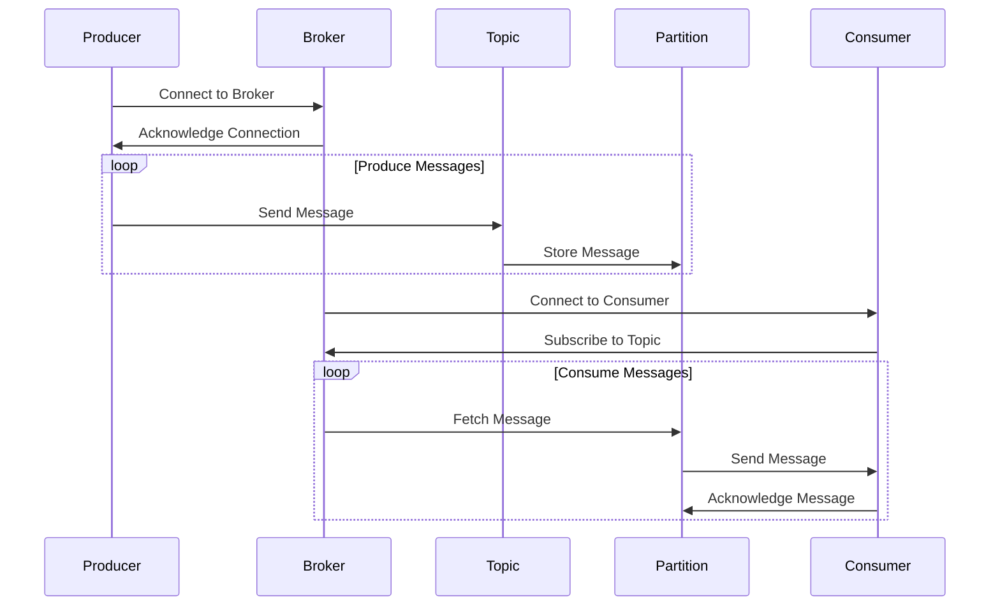
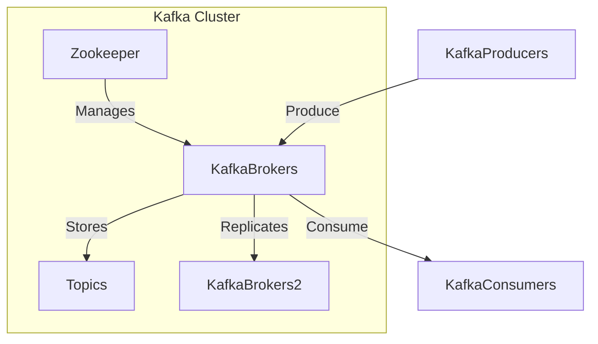
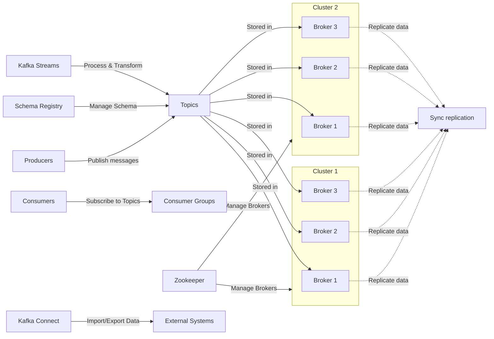
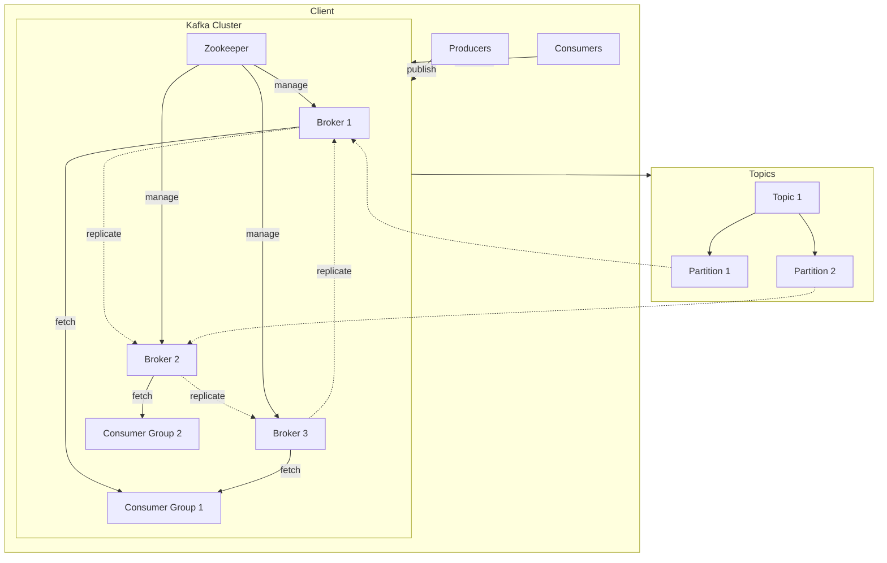
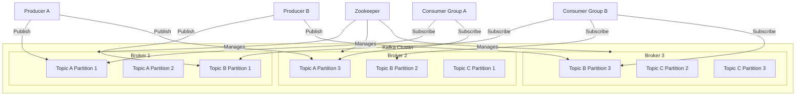
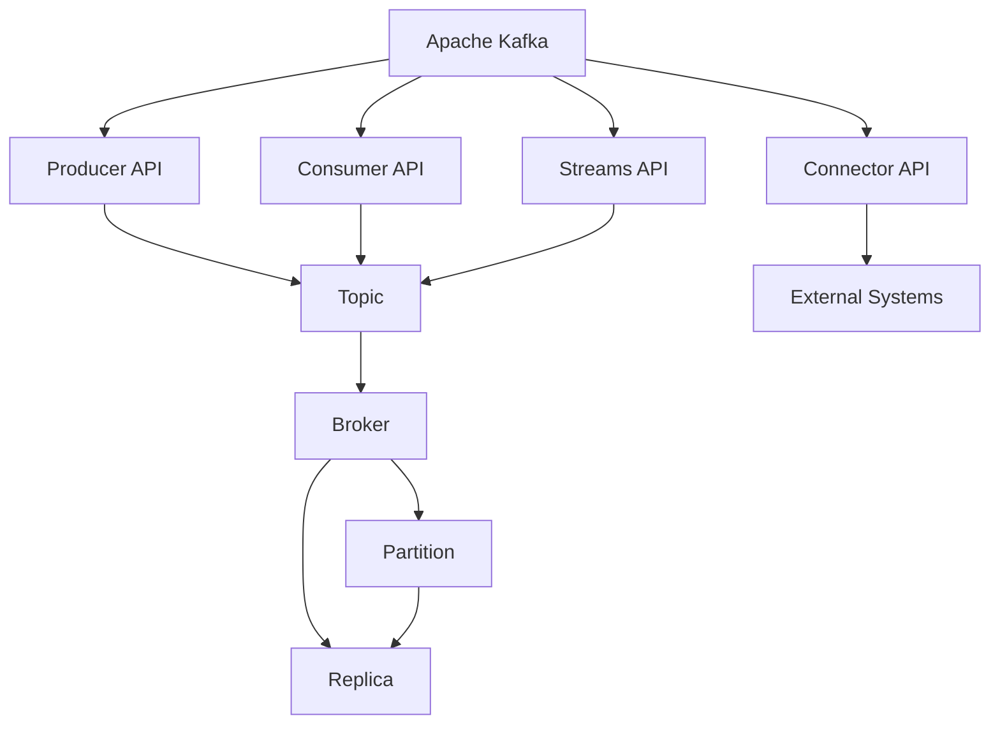

# spring-boot-kafka-service

Spring Boot application for interacting with Apache Kafka.

- This contains 2 modules
    1. spring-boot-kafka-producer
    2. spring-boot-kafka-consumer

# Table of Contents

1. [Description](#description)
2. [Features](#features)
3. [Usage](#usage)
4. [Kafka - Sequence Diagram](#kafka---sequence-diagram)
5. [Kafka - Flow Diagram - 1](#kafka---flow-diagram---1)
6. [Kafka - Flow Diagram - 2](#kafka---flow-diagram---2)
7. [Kafka - Flow Diagram - 3](#kafka---flow-diagram---3)
8. [Kafka - Flow Diagram - 4](#kafka---flow-diagram---4)
9. [Kafka - Block Diagram](#kafka---block-diagram)
10. [Apache Kafka Commands](#apache-kafka-commands)
11. [API Details](#api-details)
    - [1. Create Topic](#1-create-topic)
    - [2. Get All Topics](#2-get-all-topics)
    - [3. Delete Topic](#3-delete-topic)
    - [4. Publish Message](#4-publish-message)
    - [5. Send Events](#5-send-events)
12. [API Summary](#api-summary)

## Description

This service enables communication with Apache Kafka through RESTful APIs. It consists of two modules:
- `spring-boot-kafka-producer`: Allows publishing messages to Kafka topics.
- `spring-boot-kafka-consumer`: Facilitates consuming messages from Kafka topics.

## Features

- Sequence and flow diagrams illustrating Kafka message flow.
- Apache Kafka command usage for various operations.
- RESTful APIs for managing Kafka topics and messages.
- Detailed descriptions and examples for each API endpoint.

## Usage

Users can interact with the service via its RESTful API endpoints to manage Kafka topics and messages effectively.

For detailed usage instructions and examples, refer to the API documentation in the respective service modules.

## Kafka - Sequence Diagram



## Kafka - Flow Diagram - 1



## Kafka - Flow Diagram - 2



## Kafka - Flow Diagram - 3



## Kafka - Flow Diagram - 4



## Kafka - Block Diagram



# Apache Kafka Commands

This README provides a guide on how to use Apache Kafka with various commands.

## Prerequisites

Before running Kafka commands, make sure you have Kafka installed on your system. If not, download and install it from the [official website](https://kafka.apache.org/downloads).

## Steps

1. **Go to Kafka Installation Directory**: Navigate to the Kafka server installation directory on your system. For example:
    ```bash
    cd C:\Softwares\Kafka\kafka\bin\windows
    ```

2. **Start Zookeeper Server**: Open a command prompt and run the following command to start the Zookeeper server:
    ```bash
    ./zookeeper-server-start.bat ../../config/zookeeper.properties
    ```

3. **Start Kafka Server**: Open another command prompt and run the following command to start the Kafka server:
    ```bash
    ./kafka-server-start.bat ../../config/server.properties
    ```

4. **Create a Topic**: Use the following command to create a topic named `my-topic`:
    ```bash
    ./kafka-topics.bat --create --bootstrap-server localhost:9092 --replication-factor 1 --partitions 1 --topic my-topic
    ```

5. **List All Topics**: Run the following command to list all topics available in your Kafka cluster:
    ```bash
    ./kafka-topics.bat --list --bootstrap-server localhost:9092
    ```

6. **Delete a Topic**: To delete a topic, replace `<topic_name>` with the name of the topic you want to delete and run the following command:
    ```bash
    ./kafka-topics.bat --delete --topic <topic_name> --bootstrap-server localhost:9092
    ```

7. **Start a Producer**: Use the following command to start a Kafka producer for the `my-topic` topic:
    ```bash
    ./kafka-console-producer.bat --broker-list localhost:9092 --topic my-topic
    ```

8. **Start a Consumer**: Run the following command to start a Kafka consumer for the `my-topic` topic, consuming messages from the beginning:
    ```bash
    ./kafka-console-consumer.bat --bootstrap-server localhost:9092 --topic my-topic --from-beginning
    ```

9. **Stop Kafka Server**: To stop the Kafka server, run the following command:
    ```bash
    ./kafka-server-stop.bat
    ```

10. **Stop Zookeeper Server**: Finally, stop the Zookeeper server by running the following command:
    ```bash
    ./zookeeper-server-stop.bat
    ```

## API Details

### 1. Create Topic

- **URL** - http://localhost:8081/api/v1/kafka-service/kafka/topic?topicName=sid-test&partition=3
- **HTTP Method** - POST
- **Description:** Creates a new Kafka topic with the specified name and partition.
- **Request Parameters:**
    - `topicName`: Name of the Kafka topic to create.
    - `partition`: Number of partitions for the new topic.

- **Response** 

````
{
  "status": "Topic created successfully",
  "errorMessage": null
}
````

### 2. Get All Topics

- **URL** - http://localhost:8081/api/v1/kafka-service/kafka/topic
- **HTTP Method** - GET
- **Description:**  Retrieves a list of all existing Kafka topics.

- **Response** 

````
[
  "topic1",
  "topic2",
  "topic3"
]
````

### 3. Delete Topic

- **URL** - http://localhost:8081/api/v1/kafka-service/kafka/topic
- **HTTP Method** - DELETE
- **Description:**  Deletes the specified Kafka topic.

- **Response** 

````
{
  "status": "Topic deleted successfully",
  "errorMessage": null
}
````

### 4. Publish Message

- **URL** - http://localhost:8082/api/v1/kafka-service/publish
- **HTTP Method** - GET
- **Description:**  Publishes a message to a Kafka topic.

- **Response**

````
{
  "status": "Message published successfully",
  "errorMessage": null
}
````

### 5. Send Events

- **URL** - http://localhost:8082/api/v1/kafka-service/publish
- **HTTP Method** - POST
- **Description:**  Publishes events to a Kafka topic.
- **Request Body:** Customer object containing event details.

- **Request**

````
{
  "id": 123,
  "name": "Siddhant Patni",
  "email": "siddhant4patni@gmail.com"
}
````

- **Response**

````
{
  "status": "Events published successfully",
  "errorMessage": null
}
````

## API Summary

### 1. Create Topic
- **URL**: /api/v1/kafka-service/kafka/topic
- **Method**: POST
- **Description**: Creates a new Kafka topic with the specified name and partition count.

### 2. Get All Topics
- **URL**: /api/v1/kafka-service/kafka/topic
- **Method**: GET
- **Description**: Retrieves a list of all existing Kafka topics.

### 3. Delete Topic
- **URL**: /api/v1/kafka-service/kafka/topic
- **Method**: DELETE
- **Description**: Deletes the specified Kafka topic.

### 4. Publish Message
- **URL**: /api/v1/kafka-service/publish
- **Method**: GET
- **Description**: Publishes a message to a Kafka topic.

### 5. Send Events
- **URL**: /api/v1/kafka-service/publish
- **Method**: POST
- **Description**: Publishes events to a Kafka topic.