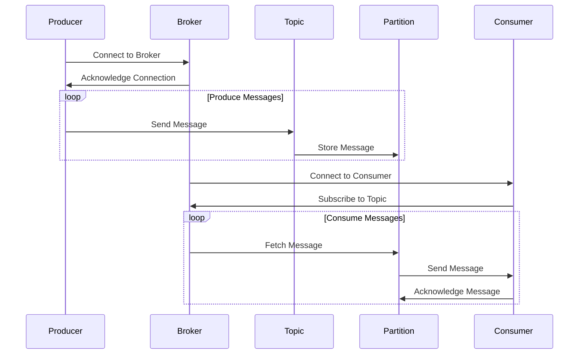
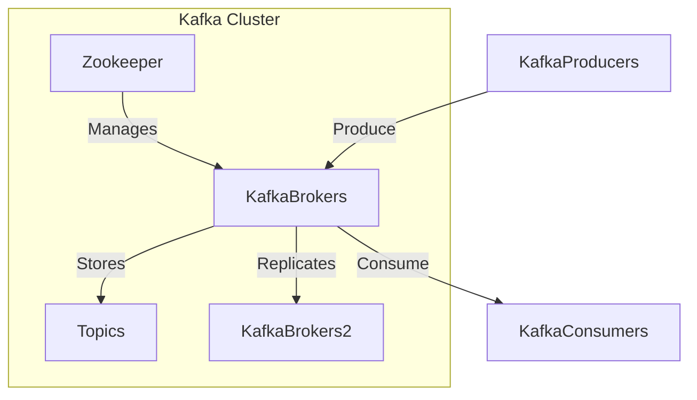
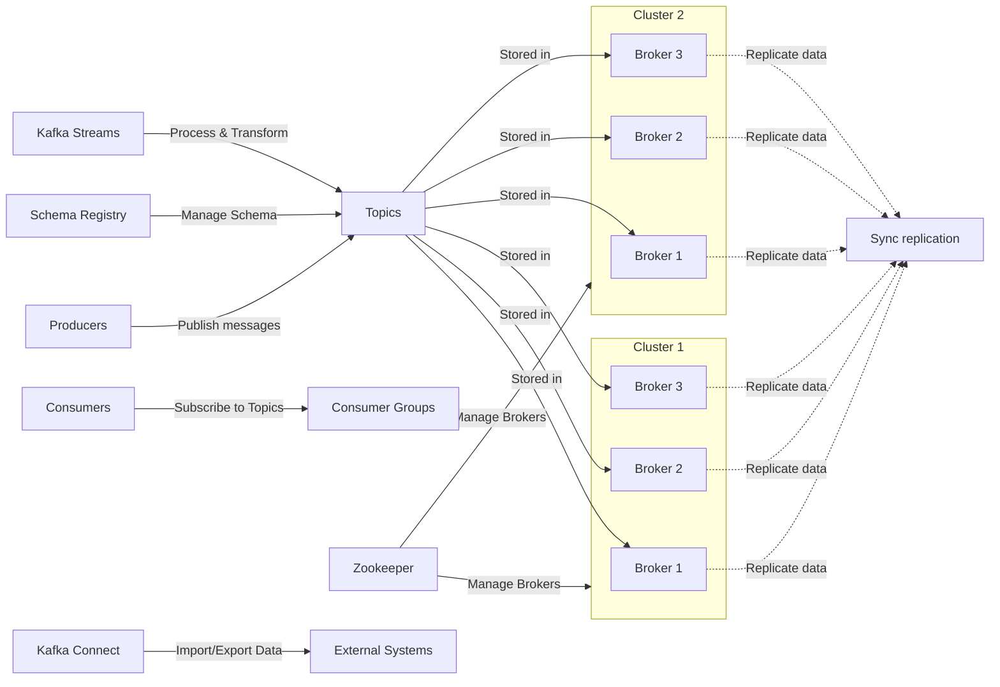
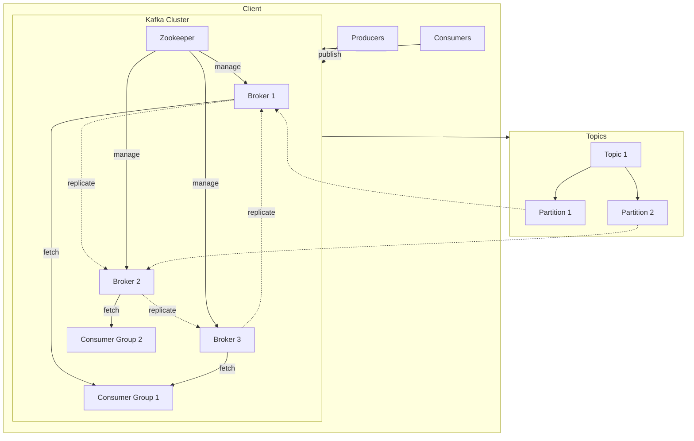
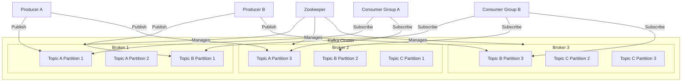

# spring-boot-kafka-service

Spring Boot App with Kafka Service.

- This contains 2 modules
    1. spring-boot-kafka-producer
    2. spring-boot-kafka-consumer

## Kafka - Sequence Diagram



## Kafka - Flow Diagram - 1



## Kafka - Flow Diagram - 2



## Kafka - Flow Diagram - 3



## Kafka - Flow Diagram - 4


# Apache Kafka Commands

This README provides a guide on how to use Apache Kafka with various commands.

## Prerequisites

Before running Kafka commands, make sure you have Kafka installed on your system. If not, download and install it from the [official website](https://kafka.apache.org/downloads).

## Steps

1. **Go to Kafka Installation Directory**: Navigate to the Kafka server installation directory on your system. For example:
    ```bash
    cd C:\Softwares\Kafka\kafka\bin\windows
    ```

2. **Start Zookeeper Server**: Open a command prompt and run the following command to start the Zookeeper server:
    ```bash
    ./zookeeper-server-start.bat ../../config/zookeeper.properties
    ```

3. **Start Kafka Server**: Open another command prompt and run the following command to start the Kafka server:
    ```bash
    ./kafka-server-start.bat ../../config/server.properties
    ```

4. **Create a Topic**: Use the following command to create a topic named `my-topic`:
    ```bash
    ./kafka-topics.bat --create --bootstrap-server localhost:9092 --replication-factor 1 --partitions 1 --topic my-topic
    ```

5. **List All Topics**: Run the following command to list all topics available in your Kafka cluster:
    ```bash
    ./kafka-topics.bat --list --bootstrap-server localhost:9092
    ```

6. **Delete a Topic**: To delete a topic, replace `<topic_name>` with the name of the topic you want to delete and run the following command:
    ```bash
    ./kafka-topics.bat --delete --topic <topic_name> --bootstrap-server localhost:9092
    ```

7. **Start a Producer**: Use the following command to start a Kafka producer for the `my-topic` topic:
    ```bash
    ./kafka-console-producer.bat --broker-list localhost:9092 --topic my-topic
    ```

8. **Start a Consumer**: Run the following command to start a Kafka consumer for the `my-topic` topic, consuming messages from the beginning:
    ```bash
    ./kafka-console-consumer.bat --bootstrap-server localhost:9092 --topic my-topic --from-beginning
    ```

9. **Stop Kafka Server**: To stop the Kafka server, run the following command:
    ```bash
    ./kafka-server-stop.bat
    ```

10. **Stop Zookeeper Server**: Finally, stop the Zookeeper server by running the following command:
    ```bash
    ./zookeeper-server-stop.bat
    ```
